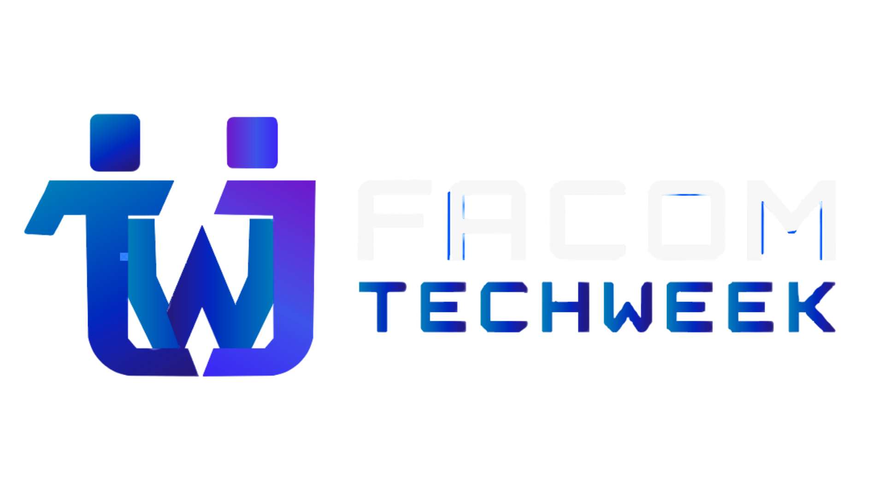

<div align="center">
  

  # ⚡ FACOM TechWeek 2026

  **A Maior Semana de Computação e Tecnologia da Faculdade de Computação da UFU**

  [](https://site-facom-tech-week.vercel.app/)
  [](https://reactjs.org/)
  [](https://vitejs.dev/)
  []()

  ### 🌐 **Acesse o site ao vivo:**  
  👉 **[site-facom-tech-week.vercel.app](https://site-facom-tech-week.vercel.app/)** 👈

</div>

---

## 📌 Sobre o Projeto

O **FACOM TechWeek 2026** é o portal oficial da tradicional semana acadêmica, científica e tecnológica organizada pela **Faculdade de Computação (FACOM)** da **Universidade Federal de Uberlândia (UFU)**.

O site foi concebido com uma estética **futurista, cibernética e imersiva**, combinando efeitos tridimensionais em tempo real, física interativa e alto desempenho para oferecer uma experiência memorável aos participantes, palestrantes e patrocinadores.

---

## ✨ Destaques & Recursos Visuais

### 🌌 1. Fundo 3D Antigravity (Onda de Partículas)
* **Visualização Tridimensional**: Motor de projeção 3D nativo rodando a 60 FPS sobre canvas HTML5 (sem dependências pesadas).
* **Física de Condutor / Maestro**: As partículas respondem suavemente ao movimento do mouse ou gestos de toque no celular (*touch*), criando elevações harmônicas e iluminação neon.
* **Fundo Unificado**: O plano de fundo de alta tecnologia engloba de forma contínua o Hero Banner e a seção de Patrocinadores sem cortes visuais.

### ⌨️ 2. Teclado Mecânico Cibernético 3D
* **Efeito Digitação**: O teclado mecânico 3D em perspectiva digita automaticamente o comando `TECHWEEK` ao rolar a página.
* **Terminal Stream**: Exibição em tempo real da história e tradição do evento através de um streaming de texto estilo terminal.
* **Contadores Dinâmicos**: Indicadores animados que contam a quantidade de participantes, anos de tradição, horas de imersão e sessões.

### 🎟️ 3. Interface Terminal de Ingressos & Sympla
* **Seleção de Perfis**: Interface no formato HUD que identifica se o participante é *Aluno FACOM*, *Aluno UFU / Professor* ou *Comunidade*.
* **Redirecionamento Seguro**: Botões integrados diretamente com a plataforma oficial do **Sympla** para conclusão da inscrição.

### 🤖 4. Mascotes Oficiais: Teko & Weeka
* Ilustrações cibernéticas originais dos mascotes com animação dinâmica de piscar de olhos e reação ao *hover*.

### 📱 5. 100% Responsivo e Otimizado
* Adaptado com *breakpoints* específicos e suporte a gestos *touch* em smartphones, tablets, notebooks e monitores ultrawide.

---

## 🛠️ Tecnologias Utilizadas

* **[React 18](https://reactjs.org/)** – Biblioteca principal para construção da interface baseada em componentes.
* **[Vite 6](https://vitejs.dev/)** – Bundler e ambiente de desenvolvimento ultrarrápido.
* **[Lucide React](https://lucide.dev/)** – Conjunto de ícones vetoriais modernos e leves.
* **HTML5 Canvas & 3D Math Engine** – Projeção de perspectiva 3D, cálculos trigonométricos e iluminação aditiva (*lighter composite*).
* **CSS Glassmorphism & Custom Properties** – Efeitos de vidro fosco, neon e gradientes cibernéticos.

---

## 💻 Como Rodar o Projeto Localmente

### Pré-requisitos
* **Node.js** (versão 18 ou superior)
* **npm** ou **yarn**

### Passo a Passo

1. **Clonar o repositório:**
   ```bash
   git clone https://github.com/ShayeneFigueredo/site-facom-tech-week.git
   cd site-facom-tech-week
   ```

2. **Instalar as dependências:**
   ```bash
   npm install
   ```

3. **Iniciar o servidor de desenvolvimento:**
   ```bash
   npm run dev
   ```

4. **Abrir no navegador:**
   Navegue até `http://localhost:5173` para visualizar o site rodando localmente.

5. **Gerar o build de produção:**
   ```bash
   npm run build
   ```

---

## 👥 Desenvolvedores & Créditos

Este projeto foi desenvolvido com dedicação e paixão por tecnologia por:

<div align="center">
  <table>
    <tr>
      <td align="center">
        <a href="https://github.com/ShayeneFigueredo">
          <br />
          <sub><b>Shayene Figueredo</b></sub>
        </a>
      </td>
      <td align="center">
        <a href="https://github.com/samuelamorim">
          <br />
          <sub><b>Samuel Amorim</b></sub>
        </a>
      </td>
    </tr>
  </table>
</div>

---

<div align="center">
  <sub>Desenvolvido para a <b>FACOM TechWeek 2026</b> • Faculdade de Computação — Universidade Federal de Uberlândia (UFU)</sub>
</div>
